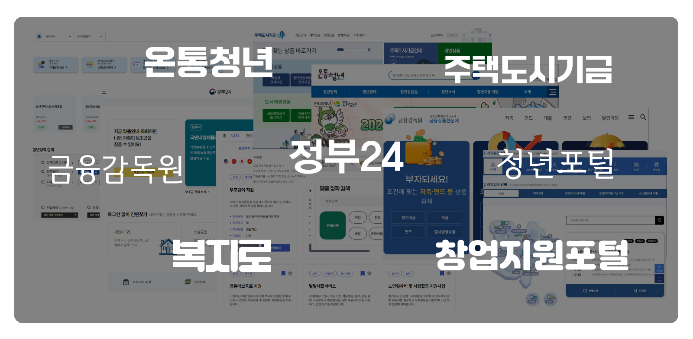

<div align="center">
<h1>Chat Jiwon</h1>



여기저기 흩어져있는 지원 정책 정보들,
알아보기 너무 막막해...!

<strong>바로 그럴 때</strong>

<strong>챗 지원</strong>을 통해
내게 맞는 지원 정책을 쉽게 찾아보세요😇
</div>

<br />
<br />


## 사용 화면
https://github.com/user-attachments/assets/fa2d8d7d-1652-47eb-a527-240e707e164e


<br />
<br />

## 사용 방법

### 1. 다운로드
```bash
git clone https://github.com/ramge132/chat_jiwon.git
```

<br /> 

### 2. 가상환경 구축

가상환경 구축을 위해
프로젝트 루트 디렉토리에서 다음을 실행
```bash
python -m venv venv
```
```bash
source venv/Scripts/activate
```

<br />  

### 3. 의존 패키지 설치
```bash
pip install -r requirements.txt 
```
```bash
cd front/chatingUI
```
``` bash
npm install
```

<br />


### 4. 실행  
> 두개의 터미널 창이 필요


`$jiwon_bot/front/chatingUI` 에서
``` bash
npm run dev
```
`http://localhost:1573/` 클릭
  
<br>

`$jiwon_bot/flask` 에서
``` bash
cd ../../flask
```
```bash
python app.py
```
`TF_ENABLE_ONEDNN_OPTS=0`와 같은 문구는  
CPU를 사용하므로 속도가 느릴 수 있다는 경고문

<br />

### 5. API KEY 할당
.env를 루트 디렉토리에 생성하고 아래 내용 저장
```
PERPLEXITY_API_KEY = "여기에 API KEY 입력"
```

Perplexity API 링크: https://www.perplexity.ai/settings/api
